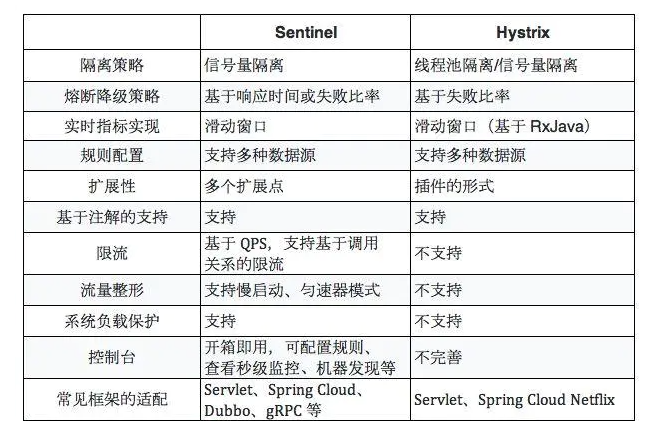
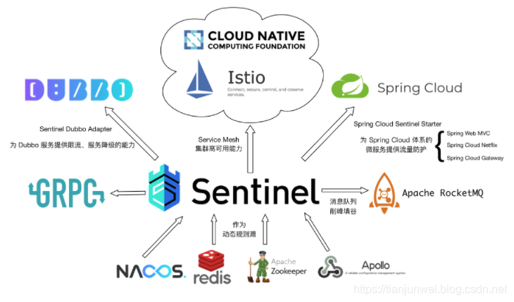

# Spring Cloud Alibaba
## Nacos
* 配置中心
* 服务注册和服务发现
## RocketMQ
消息队列 RocketMQ应用场景：
1. 削峰填谷  
   * 场景一： 预约购买
      1. 引入RocketMQ 后，当预约活动开始时，海量并发访问汹涌袭来：
      2. 所有客户的预约申请，页面均立即返回成功。客户便可关闭网页进行其他活动。预约码稍后推送到客户的邮箱/手机；
      3. 超过千万级别的注册、预约申请，先暂存在RocketMQ消息队列集群；
      4. 后端服务进行处理，按照数据库实际的能力处理注册、预约申请；
      5. 处理成功后返回结果给用户。预约结束后，用户在一定时间内都收到了预约码。  
   
   * 场景二：秒杀  
       1. 用户发起海量秒杀请求到秒杀业务处理系统。  
       2. 秒杀处理系统按照秒杀处理逻辑将满足秒杀条件的请求发送至消息队列 RocketMQ 。
       3. 下游的通知系统订阅消息队列 RocketMQ 版的秒杀相关消息，再将秒杀成功的消息发送到相应用户
       4. 用户收到秒杀成功的通知
   * 场景三：点赞
       1. 不限制用户点赞数，用户高频率点赞
       2. 将所有点赞请求发送到RocketMQ削峰
       3. 服务端在处理点赞数时，按消费者能够承载的消费数量消费， 剩余的点赞数慢慢消费
2. 异步解耦  
上游业务与下游业务解耦  
3. 分布式事务消息  
补偿事务保证事务最终一致性
## Sentinel
[官方资料](https://sentinelguard.io/zh-cn/docs/introduction.html)
1. 丰富的应用场景：Sentinel 承接了阿里巴巴近 10 年的双十一大促流量的核心场景，例如秒杀（即突发流量控制在系统容量可以承受的范围）、消息削峰填谷、集群流量控制、实时熔断下游不可用应用等。
2. 完备的实时监控：Sentinel 同时提供实时的监控功能。您可以在控制台中看到接入应用的单台机器秒级数据，甚至 500 台以下规模的集群的汇总运行情况。
3. 广泛的开源生态：Sentinel 提供开箱即用的与其它开源框架/库的整合模块，例如与 Spring Cloud、Dubbo、gRPC 的整合。您只需要引入相应的依赖并进行简单的配置即可快速地接入 Sentinel。  

生态：  
