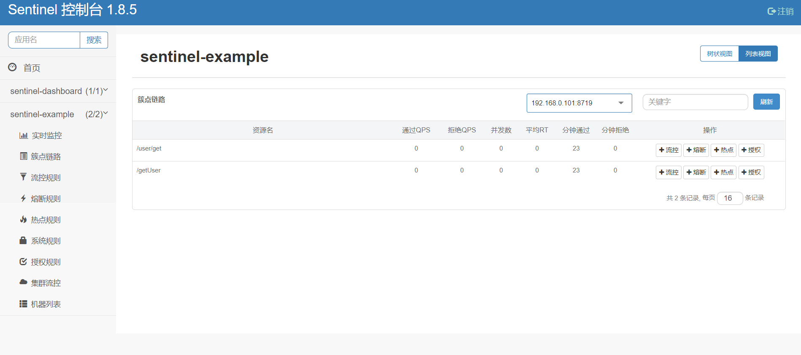
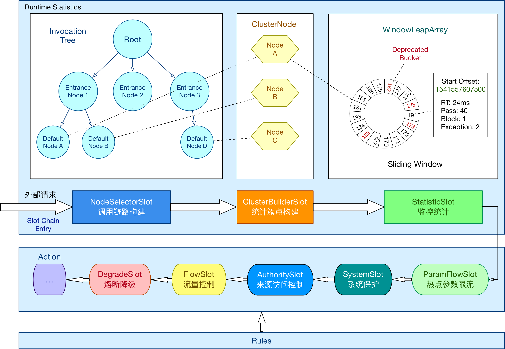

# Sentinel

## Sentinel Dashboard
镜像：  
docker pull bladex/sentinel-dashboard  
运行：  
docker run -itd -p 8858:8858 --name sentinel-test bladex/sentinel-dashboard
本地运行：  
java -Dserver.port=8080 -Dcsp.sentinel.dashboard.server=localhost:8080 -Dproject.name=sentinel-dashboard -jar sentinel-dashboard.jar

* 概念
  1. RT  
     平均响应时间( DEGRADE_GRADE_RT):当1s内持续进入5个请求，对应时刻的平均响应时间(秒
     级）均超过阈值（count，以ms为单位)，那么在接下的时间窗口（DegradeRule中的timewindow，以s为单位)之内，对这个方法的调用都会自动地熔断(抛出
     DegradeException )。注意Sentinel默认统计的RT上限是4900 ms，超出此阈值的都会算作4900 ms，若需要变更此上限可以通过启动配置项-Dcsp.sentinel.statistic.max.rt=x来配置。

  2. 异常比例
  出现异常请求数的比例
  3. 异常数
  出现异常的请求数
  4. 慢调用比例
  请求响应时间超过了平均响应时间的请求数所占的比例。

## 依赖
```xml
<dependencys>
    <dependency>
        <groupId>com.alibaba.cloud</groupId>
        <artifactId>spring-cloud-starter-alibaba-sentinel</artifactId>
    </dependency>
    <dependency>
        <groupId>com.alibaba.cloud</groupId>
        <artifactId>spring-cloud-starter-alibaba-nacos-config</artifactId>
    </dependency>
    <dependency>
        <groupId>com.alibaba.csp</groupId>
        <artifactId>sentinel-datasource-nacos</artifactId>
    </dependency>
</dependencys>

```
## 配置
application.yml
```yaml
spring:
  cloud:
    # nacos 配置中心
    nacos:
      username: nacos
      password: nacos
      config:
        enable: true
        server-addr: 192.168.0.196:8848
        file-extension: yaml
        group: DEFAULT_GROUP
        refresh-enabled: true
    sentinel:
      transport:
        dashboard: localhost:8080
        # sentinel 暴漏API端口 http://localhost:8719/cnode?id=resourceName
        port: 8719
      datasource:
        ds1:
          # sentinel nacos 持久化
          nacos:
            server-addr: 192.168.0.196:8848
            # 不带后缀
            dataId: ${spring.application.name}
            groupId: SENTINEL-GROUP
            username: nacos
            password: nacos
            dataType: json
            ruleType: flow

      log:
        dir: ./target
```
Nacos中的配置信息sentinel-example-datasource.json  

resource:资源名称(就是要添加流控的资源名)  
limitApp:来源应用  
grade:阀值类型,0表示线程数,1表示QPS;  
count:单击阀值  
strategy:流控模式,0表示直接,1表示关联,2表示链路;  
controlBehavior:流控效果,0表示快速失败,1表示Warm Up,2表示排队等待  
clusterMode:是否集群.  

```json
[
  {
    "resource":"/getUser",
    "controlBehavior":0,
    "count":10,
    "grade":1,
    "limitApp":"default",
    "strategy":0,
    "clusterMode":false
  }
]
```
## 框架
在 Sentinel 里面，所有的资源都对应一个资源名称以及一个 Entry。Entry 可以通过对主流框架的适配自动创建，也可以通过注解的方式或调用 API 显式创建；每一个 Entry 创建的时候，同时也会创建一系列功能插槽（slot chain）。这些插槽有不同的职责，例如:

NodeSelectorSlot 负责收集资源的路径，并将这些资源的调用路径，以树状结构存储起来，用于根据调用路径来限流降级；  
ClusterBuilderSlot 则用于存储资源的统计信息以及调用者信息，例如该资源的 RT, QPS, thread count 等等，这些信息将用作为多维度限流，降级的依据；  
StatisticSlot 则用于记录、统计不同纬度的 runtime 指标监控信息；  
FlowSlot 则用于根据预设的限流规则以及前面 slot 统计的状态，来进行流量控制；  
AuthoritySlot 则根据配置的黑白名单和调用来源信息，来做黑白名单控制；  
DegradeSlot 则通过统计信息以及预设的规则，来做熔断降级；  
SystemSlot 则通过系统的状态，例如 load1 等，来控制总的入口流量；  

## 使用场景
1. 流量控制
   * 并发线程控制
   * QPS 流量控制 
     访问资源信息 curl http://localhost:8719/cnode?id=resourceName
     1. 直接拒绝（CONTROL_BEHAVIOR_DEFAULT）  
        是默认的流量控制方式，当QPS超过任意规则的阈值后，新的请求就会被立即拒绝，拒绝方式为抛出FlowException。
        这种方式适用于对系统处理能力确切已知的情况下，比如通过压测确定了系统的准确水位时。
     2. Warm Up（CONTROL_BEHAVIOR_WARM_UP）  
        即预热/冷启动方式。当系统长期处于低水位的情况下，当流量突然增加时，直接把系统拉升到高水位可能瞬间把系统压
        垮。通过"冷启动"，让通过的流量缓慢增加，在一定时间内逐渐增加到阈值上限，给冷系统一个预热的时间，避免冷系统被压垮。
     3. 匀速排队（CONTROL_BEHAVIOR_RATE_LIMITER，漏桶算法 ）
        会严格控制请求通过的间隔时间，也即是让请求以均匀的速度通过，其实对应的是漏桶算法。当请求数量远远大于阈值时，这些请求会排队等待，这个等待时间可以设置，如果超过等待时间，那这个请求会被拒绝。这种方式主要用于处理间隔性突发的流量，例如消息队列。
        属性设置：  
        controlBehavior：RuleConstant.CONTROL_BEHAVIOR_RATE_LIMITER   
        maxQueueingTimeMs：排队等待时间，表示每一次请求最长等待时间，默认是500ms
     4. 冷启动+匀速器（CONTROL_BEHAVIOR_WARM_UP_RATE_LIMITER），除了让流量缓慢增
        加，还还控制的了请求的间隔时间，让请求均匀速度通过。
    
2. 熔断降级`
3. 系统自适应保护
4. 集群流量控制
5. 网关流量控制
6. 来源访问控制
7. 热点参数限流
8. 注解支持  
   @SentinelResource 用于定义资源，并提供可选的异常处理和 fallback 配置项。 @SentinelResource 注解包含以下属性：
   * value：资源名称，必需项（不能为空）  
   * entryType：entry 类型，可选项（默认为 EntryType.OUT）  
   * blockHandler / blockHandlerClass: blockHandler 对应处理 BlockException 的函数名称，可选项。blockHandler 函数访问范围需要是 public，返回类型需要与原方法相匹配，参数类型需要和原方法相匹配并且最后加一个额外的参数，类型为 BlockException。blockHandler 函数默认需要和原方法在同一个类中。若希望使用其他类的函数，则可以指定 blockHandlerClass 为对应的类的 Class 对象，注意对应的函数必需为 static 函数，否则无法解析。
   * fallback：fallback 函数名称，可选项，用于在抛出异常的时候提供 fallback 处理逻辑。fallback 函数可以针对所有类型的异常（除了 exceptionsToIgnore 里面排除掉的异常类型）进行处理。fallback 函数签名和位置要求：
   返回值类型必须与原函数返回值类型一致；  
   方法参数列表需要和原函数一致，或者可以额外多一个 Throwable 类型的参数用于接收对应的异常。  
   fallback 函数默认需要和原方法在同一个类中。若希望使用其他类的函数，则可以指定 fallbackClass 为对应的类的 Class 对象，注意对应的函数必需为 static 函数，否则无法解析。
   defaultFallback（since 1.6.0）：默认的 fallback 函数名称，可选项，通常用于通用的 fallback 逻辑（即可以用于很多服务或方法）。默认 fallback 函数可以针对所以类型的异常（除了 exceptionsToIgnore 里面排除掉的异常类型）进行处理。若同时配置了 fallback 和 defaultFallback，则只有 fallback 会生效。defaultFallback 函数签名要求：
   返回值类型必须与原函数返回值类型一致；  
   方法参数列表需要为空，或者可以额外多一个 Throwable 类型的参数用于接收对应的异常。    
   defaultFallback 函数默认需要和原方法在同一个类中。若希望使用其他类的函数，则可以指定 fallbackClass 为对应的类的 Class 对象，注意对应的函数必需为 static 函数，否则无法解析。  
   exceptionsToIgnore（since 1.6.0）：用于指定哪些异常被排除掉，不会计入异常统计中，也不会进入 fallback 逻辑中，而是会原样抛出。  
   注：1.6.0 之前的版本 fallback 函数只针对降级异常（DegradeException）进行处理，不能针对业务异常进行处理。  
   特别地，若 blockHandler 和 fallback 都进行了配置，则被限流降级而抛出 BlockException 时只会进入 blockHandler 处理逻辑。若未配置 blockHandler、fallback 和 defaultFallback，则被限流降级时会将 BlockException 直接抛出。
9. 实时监控