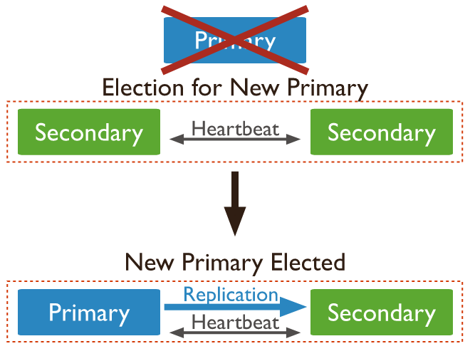

## 简介
MongoDB是一个跨平台，面向文档的数据库，提供高性能，高可用性和易于扩展。MongoDB是工作在集合和文档上一种概念。\
采用集合的方式，集合是MangoDB一组文件,一个集合存在于数据库中,合中的文档可以有不同的字段。通常情况下，在一个集合中的所有文件都是类似或相关目的 \
文档是一组键值对。文档具有动态模式。动态模式是指，在同一个集合的文件不必具有相同一组集合的文档字段或结构，并且相同的字段可以保持不同类型的数据。 \
[官方文档](https://www.mongodb.com/docs/manual/tutorial/getting-started/) \
数据库 > 集合 > 文档

## CRUD
### 数据库操作
* 创建数据库 
  >&gt; use DATABASE_NAME
* 查看当前数据库 
  >&gt; db
* 查看所有数据库 
  >&gt; show dbs  或者 show databases
* 删除数据库 
  >&gt; db.dropDatabase()
### 集合操作
  * 创建集合 
    >&gt; db.createCollection(name, options) \
    &gt; db.createCollection("mycol", {capped : true, autoIndexId : true, size : 6142800, max : 10000 })
  
| 字段          | 类型      | 描述                                                                              |
|-------------|---------|---------------------------------------------------------------------------------|
| capped      | boolean | (可选)如果为true，则启用封闭的集合。上限集合是固定大小的集合，它在达到其最大大小时自动覆盖其最旧的条目。 <br/>如果指定true，则还需要指定size参数。  |
| autoIndexId | boolean |(可选)如果为true，则在_id字段上自动创建索引。默认值为false|
|size| number  |(可选)指定上限集合的最大大小(以字节为单位)。 如果capped为true，那么还需要指定此字段的值。|
|max| number  |(可选)指定上限集合中允许的最大文档数。|
 
 * 删除集合
 >&gt; db.collectionName.drop()
### 文档操作
 * 插入文档 
 >&gt; db.COLLECTION_NAME.insert(document) \
 &gt; db.COLLECTION_NAME.insertOne(document) \
 &gt; db.COLLECTION_NAME.insertMany(document)
 * 查询文档  
 >&gt; db.mycol.find() \
 &gt; db.mycol.find().pretty()   // pretty() 格式化显示（json）
 * 更新文档 
 >&gt; db.COLLECTION_NAME.update(SELECTION_CRITERIA, UPDATED_DATA)

 eg:
 > &gt;db.book.update({'name':'Kubernetes权威指南'},{$set:{'publishedInformation.price':138.01}}) 
* 原子更新
>&gt;db.products.findAndModify({
    query:{_id:2,product_available:{$gt:0}},
    update:{
        $inc:{product_available:-1},
        $push:{product_bought_by:{customer:"Curry",date:"2017-08-08"}}
    }    
})


除此之外save() 也可以更新文档 
>&gt; db.COLLECTION_NAME.save({_id:ObjectId(),NEW_DATA})
 * 删除文档
 >&gt; db.COLLECTION_NAME.remove(DELETION_CRITERIA,1) \
 &gt; db.COLLECTION_NAME.remove()   //删除所有
 * 投影查询
 KEY 的值如果是0 表示隐藏该字段显示，1 表示不隐藏
 > &gt; db.COLLECTION_NAME.find({},{KEY:1})
 * 限制记录数
 > &gt;db.COLLECTION_NAME.find().limit(NUMBER) \
  &gt; db.COLLECTION_NAME.find().limit(NUMBER).skip(NUMBER)   // 跳过文档个数后，查询个数，可用于分页
 * 排序记录 \
   指定排序顺序1和-1。 1用于升序，而-1用于降序
 > &gt; db.COLLECTION_NAME.find().sort({KEY:1}) 
 * 聚合查询 \
 
| 表达式  | 描述                   | 示例  |
|------|----------------------|-----|
 | $sum | 求和                   |     |
| $avg | 均值                   |     |
| $min | 最小值                  |     |
 | $max | 最大值                  |     |
|$push| 将值插入到生成的文档数组中        ||
|$addToSet| 将值插入生成的文档中的数组，不会有重复值 ||
|$first|根据分组从源文档获取第一个文档。 通常情况下，这只适用于以前应用的“$sort”阶段。||
|$last|根据分组从源文档获取最后一个文档。通常情况下，这只适用于以前应用的“$sort”阶段。||

 > &gt; db.article.aggregate([{$group : {_id : "$by_user", num_tutorial : {$sum : 1}}}])

## 索引
* MongoDB 索引基于B-Tree
  * 多路非二叉树
  * 每个节点既保存数据又保存索引
  * 搜索时相当于二分查找 \
* 创建普通索引
  这里的key是要在其上创建索引的字段的名称，1是升序。 要按降序创建索引，需要使用-1
> &gt; db.COLLECTION_NAME.ensureIndex({KEY:1}) \
在ensureIndex()方法中，可以传递多个字段，以在多个字段上创建索引。
* 创建唯一索引
> &gt; db.book.ensureIndex({'name':1},{'unique':true}) 
* 创建复合索引
> &gt; db.book.ensureIndex({'name':1,'author':1}) 
* 创建文本索引
> &gt; db.book.ensureIndex({'intro':"text"})
* 查看索引
> &gt; db.book.getIndexes() \
[ \
  { v: 2, key: { _id: 1 }, name: '_id_' },\
  { v: 2, key: { name: 1 }, name: 'name_1', unique: true }, \
  { \
    v: 2, \
    key: { _fts: 'text', _ftsx: 1 }, \
    name: 'intro_text', \
    weights: { intro: 1 }, \
    default_language: 'english', \
    language_override: 'language',\
    textIndexVersion: 3 \
    } \
]
* 删除索引
> &gt;db.book.dropIndex("intro_text")
* 索引最大范围 \
  集合不能有超过64个索引。  \
  索引名称的长度不能超过125个字符。 \
  复合索引最多可以编号31个字段。  
## 事务
MongoDB 4.2 更新的 MongoDB 支持如下事务操作：
Session.startTransaction() \
Session.commitTransaction() \
Session.abortTransaction()
> &gt; session = db.getMongo().startSession( { readPreference: { mode: "primary" } } );  // 定义session \
> &gt; session.startTransaction( { readConcern: { level: "local" }, writeConcern: { w: "majority" } } ); \
> &gt; session.commitTransaction(); // 提交事务
> &gt; session.abortTransaction();  // 终止事务
> &gt; session.endSession();  // 结束事务
 
## 备份与恢复
创建备份：
> &gt; mongodump --out=<path>\
> &gt; mongodump --uri="mongodb://mongodb0.example.com:27017" [additional options]

该命令将连接到运行在 127.0.0.1 和端口 27017 的服务器，并将服务器的所有数据恢复到目录/bin/dump/。 以下是命令的输出
备份恢复：
> &gt; mongorestore --uri "mongodb://user@mongodb1.example.net:27017/?authSource=admin" /opt/backup/mongodump-2011-10-24
## GridFS
GridFS是用于存储和检索大型文件(如图像，音频文件，视频文件等)的MongoDB规范。它是一种用于存储文件的文件系统，但其数据存储在MongoDB集合中。 GridFS存储文件可超过文件大小限制为16MB的功能。 \
mongofiles <options> <connection-string> <command> <filename or _id>

## 集群搭建
集群分为三种模式：主从模式，副本模式，分片模式
对于副本模式：
当Secondary节点个数为偶数时，可以通过增加一个Arbiter节点来选举，避免陷入无限重复选举 \
在设置副本集从（Secondary）节点时，
``````json
{
"_id" : "<num>",
"host" : "<hostname:port>",
"priority" : 0,
"secondaryDelaySecs" : "<seconds>",
"hidden" : true
}
``````
* priority 优先级设置
  priority 0成员是 不能成为主要成员并且不能触发 选举的成员。优先级为 0 的成员也必须是投票成员（即members[n].votes大于0）才能确认写。 \
  具有 priority 0正常辅助节点功能的辅助节点：它们维护数据集的副本，接受读取操作，并在选举中投票。 \
* hidden 隐藏设置
  客户端不会将具有适当读取首选项的读取分配给隐藏成员。因此，除了基本复制之外，这些成员不会收到任何流量。将隐藏成员用于报告和备份等专门任务。
  隐藏成员可以在副本集选举中投票。如果您停止投票的隐藏成员，请确保该集合具有活跃的多数，否则 主要成员将下台。
* secondaryDelaySecs
  延迟成员会延迟从源oplog复制和应用操作。在选择延迟量时，请考虑延迟量： \
  * 必须等于或大于您预期的维护窗口持续时间。
  * 必须小于oplog 的容量。有关 oplog 大小的更多信息，请参阅Oplog 大小。
### 主从模式
* 主副本集模式
副本集的所有成员都可以接受读取操作。但是，默认情况下，应用程序会将其读取操作定向到主要成员 \

副本集选举： \

* 主从副本集模式

主节点执行：
>&gt; rs.initiate({_id:'dataA',members:[
{_id:1,host:'192.168.0.186:27017',priority:3},
{_id:2,host:'192.168.0.196:27017',priority:2},
{_id:3,host:'192.168.0.189:27017',priority:1}]})

无投票权的成员同时具有votes并且 priority等于0：
``````json
{
   "_id" : "<num>",
   "host" : "<hostname:port>",
   "arbiterOnly" : false,
   "buildIndexes" : true,
   "hidden" : false,
   "priority" : 0,
   "tags" : {
   },
   "secondaryDelaySecs" : "NumberLong(0)",
   "votes" : 0
}
``````
### 副本模式
* 主节点（Primary）: Primary 是副本集的主节点，可读写，唯一可以进行写操作的节点，由集群自行选举出来
* 副本节点（Secondary）: Seconary 会参与 Primary 选举，并从 Primary 同步最新写入的数据，以保证与 Primary 存储相同的数据（Seconary 默认不提供读写服务）
* 仲裁者（Arbiter）: Arbiter 节点只参与投票，不能被选为 Primary，并且不从 Primary 同步数据 \
  
副本模式案例：

| 节点            | 角色         |
|---------------|------------|
| 192.168.0.186 | Primary    |
| 192.168.0.196 | Secondary  |
| 192.168.0.189 | Secondary  |
| 192.168.0.198 | Arbiter    |
配置：
/etc/mongod.conf 添加：
````yaml
#副本名
replication: 
  replSetName: dataA
````

>&gt; rs.initiate({_id:'dataA',members:[
  {_id:1,host:'192.168.0.186:27017',priority:3},
  {_id:2,host:'192.168.0.196:27017',priority:2},
  {_id:3,host:'192.168.0.189:27017',priority:1},
  {_id:4,host:'192.168.0.198:27017',arbiterOnly:true}]})

添加一个副本：
>&gt; rs.add( { host: "192.168.0.185:27017", priority: 0 } )

查看副本状态：
>&gt; rs.status();
副本集作用：
  1. 异地备份（数据冗余）
  2. 故障转移（服务冗余）
  3. 负载均衡（读写分类）
  4. 高可用基石（HA）
SpringBoot MongoDB 配置：
``````
# replicaSet 副本名称 readPreference 读配置 secondary 优先
  spring.data.mongodb.uri=mongodb://192.168.0.196:27017,192.168.0.189:27017,\
     192.168.0.186:27017,192.168.0.198:27017/mytest?replicaSet=dataA&readPreference=secondaryPreferred
``````
#### 副本集同步原理：
* 一个副本集最多可以有50 个成员，但只有 7 个投票成员。 
* 要使用 MongoDB 5.3 或更高版本将多个仲裁器添加到副本集，请使用allowMultipleArbiters设置为的参数启动每个节点true：
mongod --setParameter allowMultipleArbiters=true 
* 仲裁者拥有准确的1选举投票

* intial sync（全量同步）
  1. 全量同步开始，设置 minvalid 集合的 _initialSyncFlag 字段为 true
  2. 获取主节点上的当前最新 oplog 时间戳
  3. 同步集合数据并建立索引（比较耗时）
  4. 获取主节点上的当前最新的 oplog 时间戳
  5. 读取两个 oplog 时间戳段内的 oplog 并重放
  6. 全量同步结束，设置 minvalid 集合的 _initialSyncFlag 字段为 false
* Replication（增量同步）\ 
全量同步结束后，从节点不断的从主节点拉取 oplog 并重放应用到自身，这个过程并不是由一个线程来完成的，mongodb 为了提升同步效率，将拉取 oplog 以及重放 oplog 分到了不同的线程来执行。
  1. roducer 线程：该线程不断的从主节点上拉取 oplog，并加入到一个 BlockQueue 的队列里保存着，BlockQueue 最大存储 240MB 的 oplog 数据，当超过这个阈值时，就必须等到 oplog 被 replBatcher 消费掉才能继续拉取
  2. replBatcher 线程：该线程负责逐个从 producer 线程的队列里取出 oplog，并放到自己维护的队列里，这个队列最多允许 5000 个元素，并且元素总大小不超过 512 MB，当队列满了时，就需要等待 oplogApplication 线程消费掉
  3. oplogApplication 线程：该线程会取出 replBatch 线程当前队列的所有元素，并将元素根据集合名称分散到不同的replWriter 线程（默认16个）
  4. replWriter 线程：该线程将所有的 oplog 进行回放；
  5. 等待所有 oplog 都回放完毕，最终 oplogApplication 线程将所有的 oplog 顺序写入到一个集合中，完成增量同步
 
* 心跳检测
  * 副本集创建成功后，每一个节点之间都保持着通信，即每 2s 会向整个副本集的其他节点发一次心跳检测 ping 命令
  * 副本集中每一个节点的数据库内部，维护着整个副本集节点的状态信息，一旦某一个节点超过 10s 不能收到 ping 命令的响应，就认为这个节点不能访问
  * 副本集中的主节点除了维护整体副本集节点状态信息外，还要判断是否和大多数节点可以正常通信，如果不能则要主动降级（只读状态）
* 副本集 Primary 选举场景    
  需要进行 Primary 选举的场景如下：
  * 副本集初始化 
  * 副本集被 reconfig 
  * Primary 节点宕机 
  * Primary 节点主动 stepDown（主动降级为Secondary）
### 分片模式

* 一个 MongoDB分片集群由以下组件组成：
  * shard：每个分片包含分片数据的一个子集。每个分片都可以部署为副本集。
  * mongos：mongos充当查询路由器，在客户端应用程序和分片集群之间提供接口。从 MongoDB 4.4 开始，mongos可以支持 对冲读取以最小化延迟。
  * config servers：配置服务器存储集群的元数据和配置设置。
  
MongoDB 在集合级别对数据进行分片，将集合数据分布在集群中的各个分片上。
* Server 配置：
    * configServer 配置
      ``````yaml
      sharding:
        clusterRole: configsvr //固定值
      replication:
        replSetName: dataB
      net:
        port: 27017
        bindIp: 192.168.0.196
      ``````
    * shard 配置
      ``````yaml
      #shard 1
      sharding:
        clusterRole: shardsvr //固定值
      replication:
        replSetName: dataB
      net:
        port: 27017
        bindIp: 192.168.0.198
      ``````
      ``````yaml
      #shard 2
      sharding:
        clusterRole: shardsvr //固定值
      replication:
        replSetName: dataB
      net:
        port: 27017
        bindIp: 192.168.0.186
      ``````
      ``````yaml
      #shard 3
      sharding:
        clusterRole: shardsvr //固定值
      replication:
        replSetName: dataB
      net:
        port: 27017
        bindIp: 192.168.0.189
      ``````
    * mongos 配置
      ``````yaml
       sharding:
         configDB: dataB/192.168.0.196:27017
       net:
         port: 27018
         bindIp: 192.168.0.189
      ``````
* configServer 配置启动，登录连接后执行(仅需要在一个configServer 上执行)
> &gt; rs.initiate({_id: "dataB", configsvr: true, members: [{ _id : 0, host : "192.168.0.198:27017" }]})
* shard 分片节点启动，登录连接后执行（仅在一个副本节点执行）
> &gt; rs.initiate({_id: "dataB",members: [{ _id : 0, host : "192.168.0.198:27017" },{ _id : 1, host : "192.168.0.189:27017" },{ _id : 2, host : "192.168.0.186:27017" }]})
* 启动mongos 节点，连接configServer
 mongos -f /etc/mongos.conf  \
 mongosh -host 192.168.0.196 -port 27017  //连接mongos
  * 通过mongos添加分片节点
  > &gt; sh.addShard( "dataB/192.168.0.198:27017,192.168.0.189:27017,192.168.0.186:27017")
  * 设置分片的库 (从 MongoDB 6.0 开始，对集合进行分片不需要您首先运行sh.enableSharding()配置数据库的方法)
  > &gt; sh.enableSharding(dbName)
  * hash分片
  > &gt; sh.shardCollection("records.people", { zipcode: 'hashed' } )
  * 范围分片
  > &gt; sh.shardCollection("records.people", { zipcode: 1 ...} )
* sh.shardCollection 参数 
> &gt; sh.shardCollection(
"phonebook.contacts",
  { last_name: "hashed" },
  false,   // 是否唯一
  {
    numInitialChunks: 5,  // 初始块数
    collation: { locale: "simple" }  // 可选，指定的集合shardCollection 具有默认排序规则，如果指定则必须包含
  }
)
#### 分片键 
MongoDB 使用分片键将集合的文档分布在分片之间。分片键由文档中的一个或多个字段组成。 \
要对填充的集合进行分片，该集合必须具有 以分片键开头的索引。对空集合进行分片时，如果集合还没有指定分片键的适当索引，则 MongoDB 会创建支持索引
* 分片策略 
  * 散列分片  \
    散列分片涉及计算分片键字段值的散列。然后根据散列的分片键值为每个块分配一个范围，MongoDB 在使用散列索引解析查询时会自动计算散列值。应用程序不需要计算哈希
  * 范围分片 \
    范围分片涉及根据分片键值将数据划分为范围。然后根据分片键值为每个块分配一个范围。支持基于Shard Key的范围查询。
* 优化分片键 \
  优化集合的分片键可以实现更细粒度的数据分布，并且可以解决现有键由于 基数不足而导致巨块的情况。
>  db.adminCommand( {
  refineCollectionShardKey: "test.orders",
  key: { customer_id: 1, order_id: 1 }
  } )
* 更改分片键 \
  MongoDB 4.2 开始，您可以更新文档的分片键值，除非分片键字段是不可变_id字段。 \
  更新分片键值时:
  1. 你必须在一个mongos. 不要直接在分片上发出操作。
  2. 您必须在事务中运行或作为可重试写入运行。
  3. 您必须在查询过滤器的完整分片键上包含相等条件。例如，考虑一个用作分片键的messages 集合。{ activityid: 1, userid : 1 }要更新文档的分片键值，您必须包含activityid: <value>, userid: <value>在查询过滤器中。您可以根据需要在查询中包含其他字段。
* 使用块进行数据分区
  当块超过配置的块大小时，MongoDB 会拆分块。插入和更新都可以触发块拆分。\
  一个块可以表示的最小范围是一个唯一的分片键值。不能拆分仅包含具有单个 shard key 值的文档的块
  * 块大小
  MongoDB 中的默认块大小为 128 兆字节。您可以 增加或减少块大小。考虑更改默认块大小的含义：
  小块以更频繁的迁移为代价导致数据分布更均匀。这会在查询路由 ( mongos) 层产生开销。
  大块导致更少的迁移。从网络角度和查询路由层的内部开销来看，这更有效。但是，这些效率是以数据可能分布不均为代价的。
  块大小影响 每个要迁移的块的最大文档数。
  分片现有集合时，块大小会影响最大集合大小 。分片后，块大小不限制集合大小。
  * 大块分裂
  拆分是一个防止块变得太大的过程。当一个块增长超过指定的块大小时，或者如果块中的文档数超过每个块要迁移的最大文档数，MongoDB 会根据块表示的分片键值拆分块。 \
  一个块可以在必要时被分成多个块。插入和更新可能会触发拆分。拆分是一种有效的元数据更改。要创建拆分，MongoDB 不会迁移任何数据或影响分片。 \
  拆分可能会导致跨分片的集合的块分布不均匀。在这种情况下，平衡器会在分片之间重新分配块。有关跨分片平衡块的更多详细信息，请参阅集群平衡器。
  * 块迁移
  MongoDB 迁移分片集群中的块，以在分片之间均匀分布分片集合的块。迁移可能是： 
    * 手动的。仅在有限的情况下使用手动迁移，例如在批量插入期间分发数据。有关更多详细信息，请参阅手动迁移块。
    * 自动的。当分片集合的块在分片中分布不均匀时，平衡器进程会自动迁移块。有关更多详细信息，请参阅迁移阈值。
#### 分片集群平衡器
MongoDB 平衡器是一个后台进程，用于监控 每个分片上的块数。当给定分片上的块数达到特定迁移阈值时，平衡器会尝试在分片之间自动迁移块并达到每个分片相同数量的块。 \
分片集群的平衡过程对用户和应用层是完全透明的，尽管在过程发生时可能会有一些性能影响
* 集群平衡器 \
  平衡器进程负责在每个分片集合的分片之间重新分配分片集合的块。默认情况下，平衡器进程始终处于启用状态。 \
  为了解决分片集合的不均匀块分布，平衡器将块从具有更多块的分片迁移到具有较少块数的分片。平衡器迁移块，直到跨分片的集合的块分布均匀。关于 chunk 迁移的详细信息，请参见Chunk 迁移过程。
#### 分片数量和集群数量 
  1. 分片集群仅用于解决海量数据的存储问题，且访问量不多。例如一个shard能存储M， 需要的存储总量是N，那么您的业务需要的shard和mongos数量按照以下公式计算：
  numberOfShards = N/M/0.75 （假设容量水位线为75%）
  numberOfMongos = 2+（对访问要求不高，至少部署2个mongos做高可用）
  2. 分片集群用于解决高并发写入（或读取）数据的问题，但总的数据量很小。即shard和mongos需要满足读写性能需求，例如一个shard的最大QPS为M，一个mongos的最大QPS为Ms，业务需要的总QPS为Q，那么您的业务需要的shard和mongos数量按照以下公式计算：
  numberOfShards = Q/M/0.75 （假设负载水位线为75%）
  numberOfMongos = Q/Ms/0.75