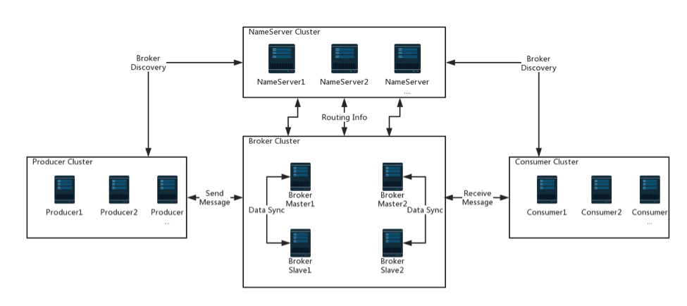
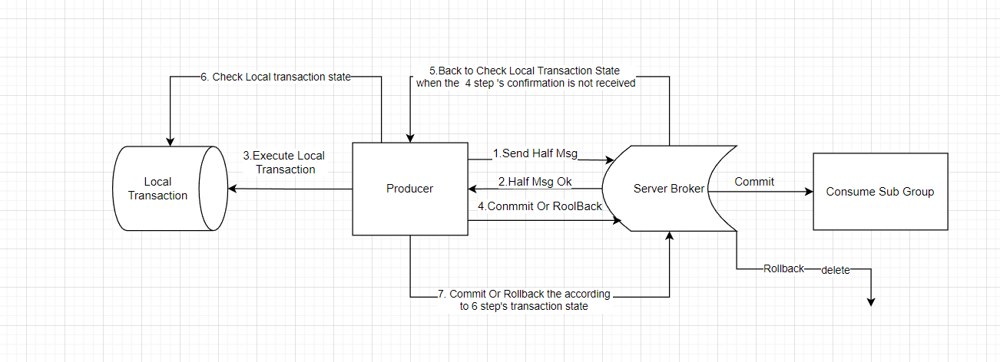

# RocketMQ


## RocketMQ Server

### RocketMQ Name Server
启动Name Server：
>nohup sh bin/mqnamesrv &

### Broker
配置详解：
``````properties
#集群名称
brokerClusterName=DefaultCluster
#broker名称
brokerName=broker-b
#master = 0, slave >= 1
brokerId=1

#对外服务的监听端口
listenPort=10911
#主要用于slave同步master
fastListenPort=10909
#haService中使用
haListenPort=10912
#是否允许 Broker 自动创建Topic，建议线下开启，线上关闭
autoCreateTopicEnable=true
#是否允许 Broker 自动创建订阅组，建议线下开启，线上关闭
autoCreateSubscriptionGroup=true
#nameServer地址，分号分割
namesrvAddr=192.168.0.196:9876;192.168.0.187:9876
#存储路径
storePathRootDir=/opt/rocketmq/data/store/broker-b
#commitLog 存储路径
storePathCommitLog=/opt/rocketmq/data/store/broker-b-s/commitlog
#消费队列存储路径存储路径
storePathConsumeQueue=/opt/rocketmq/data/store/broker-b-s
#消息索引存储路径
storePathIndex=/opt/rocketmq/data/store/broker-b-s/index
#checkpoint 文件存储路径
storeCheckpoint=/opt/rocketmq/data/store/checkpoint
#abort 文件存储路径
abortFile=/opt/rocketmq/data/store/abort

deleteWhen=04
fileReservedTime=48
#brocker 角色
brokerRole=SYNC_MASTER
flushDiskType=ASYNC_FLUSH
``````
启动Broker
> nohup ./mqbroker -c ../conf/2m-2s-sync/broker-b.properties &   // 启动master
> nohup ./mqbroker -c ../conf/2m-2s-sync/broker-b-s.properties &  // 启动slave

* 是否允许 Broker 自动创建Topic，建议线下开启，线上关闭
autoCreateTopicEnable=true
如果设置该值为false 需要手动创建，通过 updateTopic 指令创建topic
> sh mqadmin updateTopic -n "192.168.0.196:9876;192.168.0.187:9876" -t localTest -c DefaultCulster
* 是否允许 Broker 自动创建订阅组，建议线下开启，线上关闭
autoCreateSubscriptionGroup=true 通过 updateSubGroup 指令创建消费者组
> sh mqadmin updateSubGroup -n "192.168.0.196:9876;192.168.0.187:9876" -t localTest -c DefaultCulster

## 消息存储
### CommitLog
消息主体以及元数据的存储主体，存储Producer端写入的消息主体内容,消息内容不是定长的。单个文件大小默认1G, 文件名长度为20位，左边补零，剩余为起始偏移量，
比如00000000000000000000代表了第一个文件，起始偏移量为0，文件大小为1G=1073741824；当第一个文件写满了，第二个文件为00000000001073741824， 
起始偏移量为1073741824，以此类推。消息主要是顺序写入日志文件，当文件满了，写入下一个文件
### ConsumeQueue
消息消费队列，引入的目的主要是提高消息消费的性能。由于RocketMQ是基于主题topic的订阅模式，消息消费是针对主题进行的，如果要遍历commitlog文件，根据topic
检索消息是非常低效的。Consumer可根据ConsumeQueue来查找待消费的消息。其中，ConsumeQueue（逻辑消费队列）作为消费消息的索引，保存了指定Topic下的队列消息
在CommitLog中的起始物理偏移量offset，消息大小size和消息Tag的HashCode值。consumequeue文件可以看成是基于topic的commitlog索引文件，故consumequeue
文件夹的组织方式如下：topic/queue/file三层组织结构，具体存储路径为：$HOME/store/consumequeue/{topic}/{queueId}/{fileName}。同样consumequeue 
文件采取定长设计，每一个条目共20个字节，分别为8字节的commitlog物理偏移量、4字节的消息长度、8字节tag hashcode，单个文件由30W个条目组成，可以像数组一样随机
访问每一个条目，每个ConsumeQueue文件大小约5.72M
### IndexFile
IndexFile（索引文件）提供了一种可以通过key或时间区间来查询消息的方法。Index文件的存储位置是：$HOME/store/index/{fileName}，文件名fileName是以创建时
的时间戳命名的，固定的单个IndexFile文件大小约为400M，一个IndexFile可以保存 2000W个索引，IndexFile的底层存储设计为在文件系统中实现HashMap结构，故
RocketMQ的索引文件其底层实现为hash索引。
###页缓存与内存映射
页缓存（PageCache)是OS对文件的缓存，用于加速对文件的读写。一般来说，程序对文件进行顺序读写的速度几乎接近于内存的读写速度，主要原因就是由于OS使用PageCache机制
对读写访问操作进行了性能优化，将一部分的内存用作PageCache。对于数据的写入，OS会先写入至Cache内，随后通过异步的方式由pdflush内核线程将Cache内的数据刷盘至物理
磁盘上。对于数据的读取，如果一次读取文件时出现未命中PageCache的情况，OS从物理磁盘上访问读取文件的同时，会顺序对其他相邻块的数据文件进行预读取。 

在RocketMQ中，ConsumeQueue逻辑消费队列存储的数据较少，并且是顺序读取，在page cache机制的预读取作用下，Consume Queue文件的读性能几乎接近读内存，即使在有消息堆积情况下也不会影响性能。而对于CommitLog消息存储的日志数据文件来说，读取消息内容时候会产生较多的随机访问读取，严重影响性能。如果选择合适的系统IO调度算法，比如设置调度算法为“Deadline”（此时块存储采用SSD的话），随机读的性能也会有所提升。

另外，RocketMQ主要通过MappedByteBuffer对文件进行读写操作。其中，利用了NIO中的FileChannel模型将磁盘上的物理文件直接映射到用户态的内存地址中（这种Mmap的方式减少了传统IO将磁盘文件数据在操作系统内核地址空间的缓冲区和用户应用程序地址空间的缓冲区之间来回进行拷贝的性能开销），将对文件的操作转化为直接对内存地址进行操作，从而极大地提高了文件的读写效率（正因为需要使用内存映射机制，故RocketMQ的文件存储都使用定长结构来存储，方便一次将整个文件映射至内存）。

### 消息持久化
(1) 同步：如上图所示，只有在消息真正持久化至磁盘后RocketMQ的Broker端才会真正返回给Producer端一个成功的ACK响应。同步刷盘对MQ消息可靠性来说是一种不错的保障，但是性能上会有较大影响，一般适用于金融业务应用该模式较多。

(2) 异步：能够充分利用OS的PageCache的优势，只要消息写入PageCache即可将成功的ACK返回给Producer端。消息刷盘采用后台异步线程提交的方式进行，降低了读写延迟，提高了MQ的性能和吞吐量。

### 通信机制
RocketMQ消息队列集群主要包括NameServer、Broker(Master/Slave)、Producer、Consumer4个角色，基本通讯流程如下：

(1) Broker启动后需要完成一次将自己注册至NameServer的操作；随后每隔30s时间定时向NameServer上报Topic路由信息。

(2) 消息生产者Producer作为客户端发送消息时候，需要根据消息的Topic从本地缓存的TopicPublishInfoTable获取路由信息。如果没有则更新路由信息会从NameServer上重新拉取，同时Producer会默认每隔30s向NameServer拉取一次路由信息。

(3) 消息生产者Producer根据2）中获取的路由信息选择一个队列（MessageQueue）进行消息发送；Broker作为消息的接收者接收消息并落盘存储。

(4) 消息消费者Consumer根据2）中获取的路由信息，并再完成客户端的负载均衡后，选择其中的某一个或者某几个消息队列来拉取消息并进行消费。

从上面1）~3）中可以看出在消息生产者, Broker和NameServer之间都会发生通信（这里只说了MQ的部分通信），因此如何设计一个良好的网络通信模块在MQ中至关重要，它将决定RocketMQ集群整体的消息传输能力与最终的性能。

rocketmq-remoting 模块是 RocketMQ消息队列中负责网络通信的模块，它几乎被其他所有需要网络通信的模块（诸如rocketmq-client、rocketmq-broker、rocketmq-namesrv）所依赖和引用。为了实现客户端与服务器之间高效的数据请求与接收，RocketMQ消息队列自定义了通信协议并在Netty的基础之上扩展了通信模块。

### 事务消息（4.3.0v）

RocketMQ事务消息流程概要
上图说明了事务消息的大致方案，其中分为两个流程：正常事务消息的发送及提交、事务消息的补偿流程。

1.事务消息发送及提交：

(1) 发送消息（half消息）。

(2) 服务端响应消息写入结果。

(3) 根据发送结果执行本地事务（如果写入失败，此时half消息对业务不可见，本地逻辑不执行）。

(4) 根据本地事务状态执行Commit或者Rollback（Commit操作生成消息索引，消息对消费者可见）

2.补偿流程：

(1) 对没有Commit/Rollback的事务消息（pending状态的消息），从服务端发起一次“回查”

(2) Producer收到回查消息，检查回查消息对应的本地事务的状态

(3) 根据本地事务状态，重新Commit或者Rollback

其中，补偿阶段用于解决消息Commit或者Rollback发生超时或者失败的情况。

5.2 RocketMQ事务消息设计
1.事务消息在一阶段对用户不可见

在RocketMQ事务消息的主要流程中，一阶段的消息如何对用户不可见。其中，事务消息相对普通消息最大的特点就是一阶段发送的消息对用户是不可见的。那么，如何做到写入消息但是对用户不可见呢？RocketMQ事务消息的做法是：如果消息是half消息，将备份原消息的主题与消息消费队列，然后改变主题为RMQ_SYS_TRANS_HALF_TOPIC。由于消费组未订阅该主题，故消费端无法消费half类型的消息，然后RocketMQ会开启一个定时任务，从Topic为RMQ_SYS_TRANS_HALF_TOPIC中拉取消息进行消费，根据生产者组获取一个服务提供者发送回查事务状态请求，根据事务状态来决定是提交或回滚消息。

RocketMQ的具体实现策略是：写入的如果事务消息，对消息的Topic和Queue等属性进行替换，同时将原来的Topic和Queue信息存储到消息的属性中，正因为消息主题被替换，故消息并不会转发到该原主题的消息消费队列，消费者无法感知消息的存在，不会消费。其实改变消息主题是RocketMQ的常用“套路”，回想一下延时消息的实现机制。


### 消息查询
RocketMQ支持按照下面两种维度（“按照Message Id查询消息”、“按照Message Key查询消息”）进行消息查询。

* 按照MessageId查询消息
RocketMQ中的MessageId的长度总共有16字节，其中包含了消息存储主机地址（IP地址和端口），消息Commit Log offset。“按照MessageId查询消息”在RocketMQ中具体做法是：Client端从MessageId中解析出Broker的地址（IP地址和端口）和Commit Log的偏移地址后封装成一个RPC请求后通过Remoting通信层发送（业务请求码：VIEW_MESSAGE_BY_ID）。Broker端走的是QueryMessageProcessor，读取消息的过程用其中的 commitLog offset 和 size 去 commitLog 中找到真正的记录并解析成一个完整的消息返回。

* 按照Message Key查询消息
“按照Message Key查询消息”，主要是基于RocketMQ的IndexFile索引文件来实现的。RocketMQ的索引文件逻辑结构，类似JDK中HashMap的实现。

IndexFile索引文件为用户提供通过“按照Message Key查询消息”的消息索引查询服务，IndexFile文件的存储位置是：$HOME\store\index${fileName}，文件名fileName是以创建时的时间戳命名的，文件大小是固定的，等于40+500W*4+2000W*20= 420000040个字节大小。如果消息的properties中设置了UNIQ_KEY这个属性，就用 topic + “#” + UNIQ_KEY的value作为 key 来做写入操作。如果消息设置了KEYS属性（多个KEY以空格分隔），也会用 topic + “#” + KEY 来做索引。

其中的索引数据包含了Key Hash/CommitLog Offset/Timestamp/NextIndex offset 这四个字段，一共20 Byte。NextIndex offset 即前面读出来的 slotValue，如果有 hash冲突，就可以用这个字段将所有冲突的索引用链表的方式串起来了。Timestamp记录的是消息storeTimestamp之间的差，并不是一个绝对的时间。整个Index File的结构如图，40 Byte 的Header用于保存一些总的统计信息，4*500W的 Slot Table并不保存真正的索引数据，而是保存每个槽位对应的单向链表的头。20*2000W 是真正的索引数据，即一个 Index File 可以保存 2000W个索引。

“按照Message Key查询消息”的方式，RocketMQ的具体做法是，主要通过Broker端的QueryMessageProcessor业务处理器来查询，读取消息的过程就是用topic和key找到IndexFile索引文件中的一条记录，根据其中的commitLog offset从CommitLog文件中读取消息的实体内容