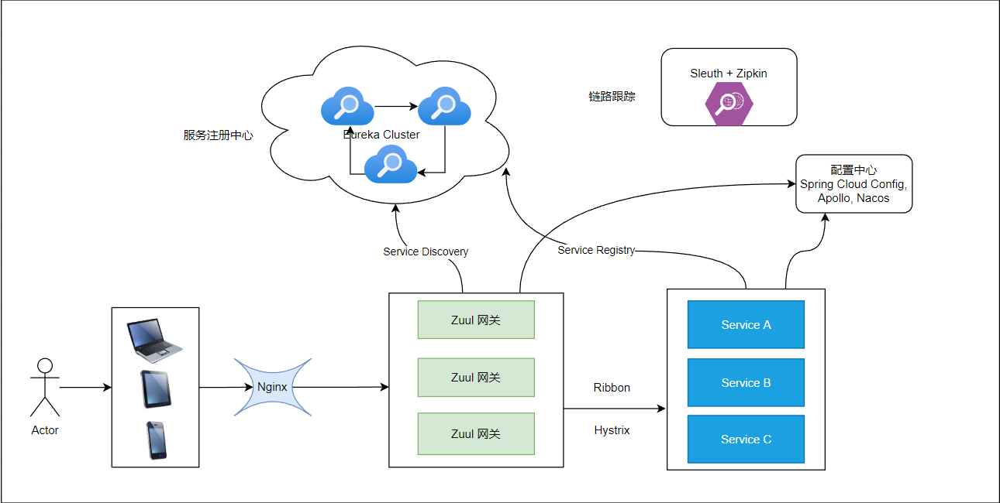

###Spring Cloud 服务架构示意图


Eureka：负责服务的注册与发现；  
Ribbon：负责客户端调用的负载均衡；  
Hystrix：负责服务之间远程调用时的容错保护；  
Feign：可以让我们通过定义接口的方式直接调用其他服务的API；  
Zuul：API网关，是客户端请求的入口，负责鉴权，路由等功能； 
Spring Cloud Config：用于统一的配置管理；   
Sleuth：用于请求的链路跟踪。 

### 案例

* [Eureka注册中心集群案例](./spring-cloud-netflix/spring-cloud-netflix-eureka/spring-cloud-eureka-server)  
端口号为 8081,8082 集群, 管理界面localhost:8081/8082  
依赖：
``````xml
<dependencys>
    <dependency>
        <groupId>org.springframework.boot</groupId>
        <artifactId>spring-boot-starter-web</artifactId>
    </dependency>
    <dependency>
        <groupId>org.springframework.cloud</groupId>
        <artifactId>spring-cloud-starter-netflix-eureka-client</artifactId>
    </dependency>
</dependencys>

``````
配置信息：
``````yaml
server:
  port: 8081
spring:
  application:
    name: eureka-server
eureka:
  instance:
    hostname: localhost
    prefer-ip-address: false
    #指定距离最后一次心跳时间多少秒后未续约,则让注册中心剔除实例
    lease-expiration-duration-in-seconds: 10
    lease-renewal-interval-in-seconds: 10
  client:
    enabled: true
    fetch-registry: true
    register-with-eureka: true
    use-dns-for-fetching-service-urls: false
    # 地区
    region: local
    # 机房
    availability-zones:
      local: local-zone1,local-zone2
    service-url:
      local-zone1: http://localhost:8081/eureka/
      local-zone2: http://localhost:8082/eureka/
  server:
    enable-self-preservation: false
    batch-replication: true
    eviction-interval-timer-in-ms: 5000
    # 每个server状态更新时间间隔
    peer-eureka-nodes-update-interval-ms: 1000
``````
* [Eureka Service Provider 案例](./spring-cloud-netflix/spring-cloud-netflix-eureka/eureka-user-service-provider)  
服务名：user-service 提供用户添加和查找接口， 用于其他Eureka Consumer提供服务   
依赖：
``````xml
<dependencys>
    <dependency>
        <groupId>org.springframework.boot</groupId>
        <artifactId>spring-boot-starter-web</artifactId>
    </dependency>
    <dependency>
        <groupId>org.springframework.cloud</groupId>
        <artifactId>spring-cloud-starter-netflix-eureka-client</artifactId>
    </dependency>
</dependencys>
``````
配置信息：
``````yaml
spring:
  application:
    name: user-service
  datasource:
    driver-class-name: com.mysql.cj.jdbc.Driver
    url: jdbc:mysql://192.168.0.196:6226/userdb?characterEncoding=utf8
    username: root
    password: root123
server:
  port: 9092
eureka:
  client:
    enable: true
    #是否可以被发现
    register-with-eureka: true
    #是否从eureka 读取注册的应用实例
    fetch-registry: true
    region: local
    availability-zones:
      local: local-zone1,local-zone2
    service-url:
      local-zone1: http://localhost:8081/eureka/
      local-zone2: http://localhost:8082/eureka/
    instance:
      instance-id: ${spring.application.name}:${server.port}

mybatis:
  mapper-locations: classpath:mappers/*.xml
  type-aliases-packag: self.study.spring.cloud.common.model
  configuration:
    map-underscore-to-camel-case: true
``````
* [Eureka + OpenFeign 服务调用](./spring-cloud-netflix/spring-cloud-netflix-openfeign)
启动方法：
``````java
@SpringBootApplication
@EnableFeignClients(basePackages = "self.study.cloud.feign")
@EnableEurekaClient
public class FeignClientApplication {

    public static void main(String[] args) {
        SpringApplication.run(FeignClientApplication.class);
    }
}
``````
Feign 客户端：
``````java
// 含义是通过Get方法调用user-service的 /user/get/v1接口 参数为 userId  UserQueryFallback 失败时调用
@FeignClient(value = "user-service", path = "/user", fallback = UserQueryFallback.class)
public interface UserClient {

    @GetMapping("/get/v1")
    ResponseResult<UserDTO> getUserByUserId(@RequestParam("userId") Long userId);
}

``````
配置信息：
``````yaml
server:
  port: 9093
spring:
  application:
    name: fegin-client-demo
eureka:
  client:
    enable: true
    #是否可以被发现
    register-with-eureka: true
    #是否从eureka 读取注册的应用实例
    fetch-registry: true
    region: local
    availability-zones:
      local: local-zone1,local-zone2
    service-url:
      local-zone1: http://localhost:8081/eureka/
      local-zone2: http://localhost:8082/eureka/
    instance:
      instance-id: ${spring.application.name}:${server.port}
feign:
  httpclient:
    enabled: true
  compression:
    request:
      # 是否压缩请求
      enabled: true
      mime-types:
        - text/xml
        - application/xml
        - application/json
      #当请求的数据容量达到多少的时候，使用压缩。默认是2048字节
      min-request-size: 10
  client:
    config:
      default:
        loggerLevel: BASIC
ribbon:
  ReadTimeout: 12000
  ConnectTimeout: 12000
  eureka:
    enabled: true
``````
* [Eureka + Zuul + Ribbon + RateLimiter 网关案例限流](./spring-cloud-netflix/spring-cloud-netflix-zuul/zuul-single-example)
``````java
@SpringBootApplication
@EnableZuulProxy
@EnableDiscoveryClient
public class ZuulProxyApplication {

    public static void main(String[] args) {
        SpringApplication.run(ZuulProxyApplication.class);
    }
}
``````
配置：
``````yaml
spring:
  application:
    name: zuul-application
  redis:

    host: 192.168.0.196
    port: 6379
    database: 0
eureka:
  client:
    enable: true
    #是否可以被发现
    register-with-eureka: true
    #是否从eureka 读取注册的应用实例
    fetch-registry: true
    region: local
    availability-zones:
      local: local-zone1,local-zone2
    service-url:
      local-zone1: http://localhost:8081/eureka/
      local-zone2: http://localhost:8082/eureka/
    instance:
      instance-id: ${spring.application.name}:${server.port}

zuul:
  routes:
    # eureka 注册的服务名
    user-service:
      path: /userService/** 
    order-service:
      path: /orderService/**
  ratelimit:
    enabled: true
    repository: REDIS  #对应存储类型（用来存储统计信息）
    behind-proxy: true  #代理之后
    default-policy: #可选 - 针对所有的路由配置的策略，除非特别配置了policies
      limit: 5 #可选 - 每个刷新时间窗口对应的请求数量限制
      quota: 4 #可选-  每个刷新时间窗口对应的请求时间限制（秒）
      refresh-interval: 5 # 刷新时间窗口的时间，默认值 (秒)
      type: #可选 限流方式
      - url
ribbon:
  ReadTimeout: 12000
  ConnectTimeout: 12000
  eureka:
    enabled: true

management:
  endpoints:
    web:
      exposure:
        include:
          - hystrix.stream
          - beans
          - env
          - routes
  endpoint:
    hystrix:
      stream:
        enabled: true
    beans:
      enabled: true
    env:
      enabled: true
    routes:
      enabled: true
    service-registry:
      enabled: true
``````